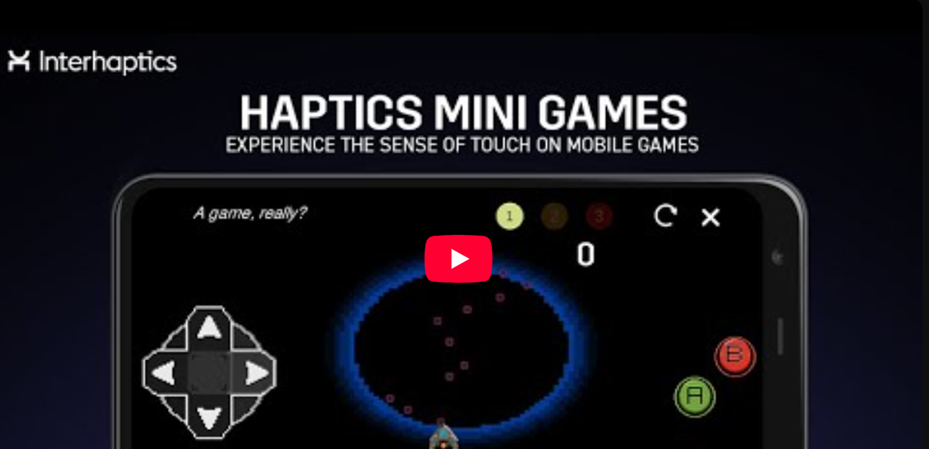

# Interhaptics Mini-games

## Introduction

Interhaptics Mini Games is a demonstration of haptic integration for mobile. The application consists of 5 game demos in which haptics adds value.
- Rider: Haptics emphasises the arcade aspect of the gameplay. It enhances acceleration, car collisions, and tricks with vibrations.
- Music Rhythm: Based on Guitar Hero, the haptic texture of the long notes and the vibration tip of the short ones bring rhythm to the game.
- Tile-matching: Making combos and destroying tiles with the haptics gives feedback to the player, confirming the success and quality of his action. 
- Runner: In this game, like the sound, the haptics confirm to the player that his action is successful. 
- Puzzle Game: For this game, the challenge was to place haptics at the core of the gameplay. All the keys to successfully complete the various puzzles are to be found in the vibrations of your mobile.

You can find out more [here](https://www.wyvrn.com/interhaptics)!

## Contribution

- Design
- Development