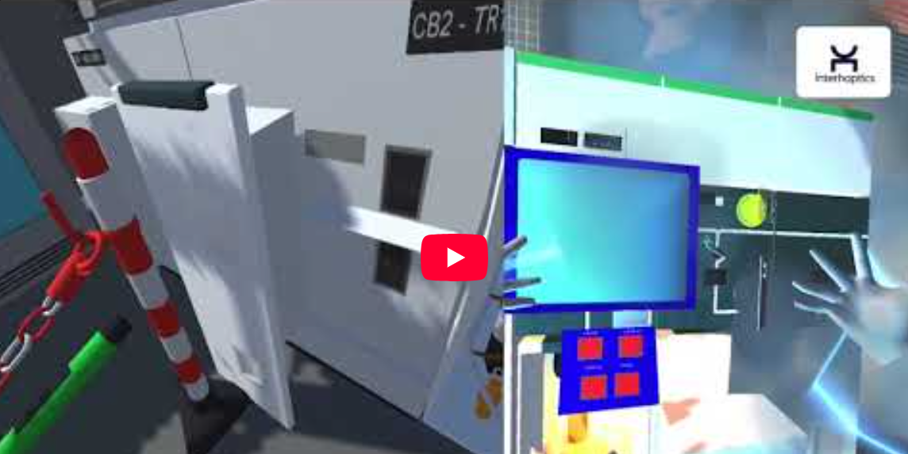

# Interhaptics Training

## Introduction

Interhaptics Training Demonstrator is a use case of the Interhaptics SDK, in a Serious Game project.
This demonstration uses the Interaction Builder (VR interaction system), and the Haptic Composer (design tool for haptic materials) of the Interhaptics SDK.

You can find out more [here](https://www.wyvrn.com/interhaptics)!

## Contribution

- Programmation 
- Game manager 
- Project refactorisations 
- Exportation to Oculus Quest