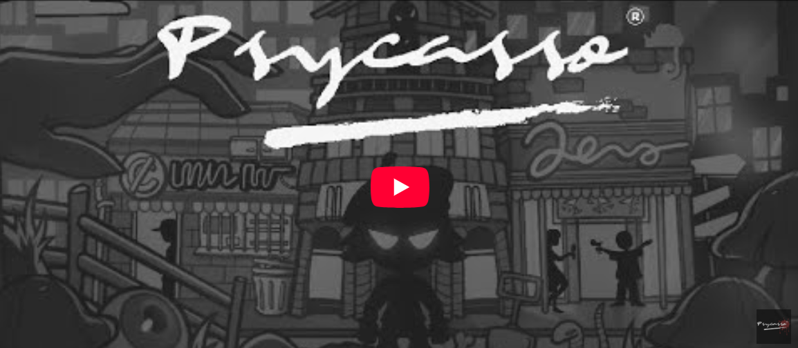

# Psycasso

## Introduction

This game follows an unsuccessful artist called ‘Psycasso’ who finds a huge rise in popularity when he combines artwork
with his secret hobby… Murder!
Battle the daily grind of city life, working a day job and trying to make ends meet. Then at night, skulk in the shadows 
to follow and kill your next victim…. or capture them and take them back to your murder room. Gathering ‘trophies’ from 
your killing spree, you’ll be able to create artwork and sculpture to sell to local galleries and make your fortune!
Exclusively for PS5, this adventure game is being developed by indie studio Omni Digital Technologies.

## Contribution

- Programming (economy system, inventory system, stats system, shop system)
- UIs integration (main menu, inventory, shop)