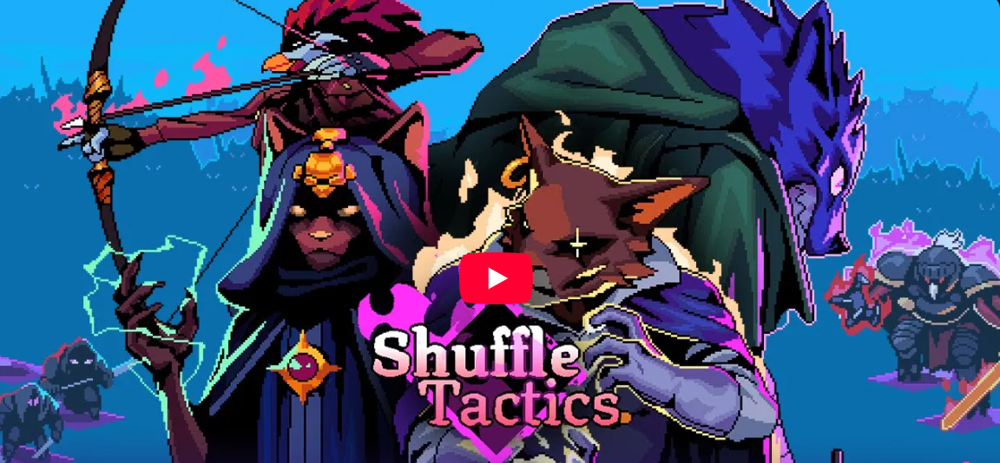

# Shuffle Tactics

## Introduction

Shuffle Tactics is a roguelike deckbuilding tactical RPG. Strategize to survive tough battles, pick the right cards to 
create powerful synergies, and bond with your sidekicks to get an edge in battle. 
Adventure awaits! Will you rise as Asteria's new King? 

## Contribution

- Architecture (Spawning, game events, entities, managers)
- Tooling (Map creator, CSV-to-card generator, flat sprite generator for card previews, class generator, Unity–Steam localization bridge tool)
- Programming (Unity/C#)
- Plugin Integration (Game Analytics, Odin, Easy Save 3, Dialogue System by Pixel Crushers)
- Asset Integration (Models, animations, UI)

## Examples

### The Map Generator 

Helps game designers and artists create maps without any coding.
- Block creation, selection, and management (Game Design)
- 3D grid system
- Spawn point management (Game Design)
- Tile-based base and top decoration (Art)
- Prop generation (Art)

### Cards Generator
  
The Cards Generator creates card assets (ScriptableObjects) from a CSV file exported from Notion.
This tool acts as a bridge between the Game Design Document (GDD) and the Unity project, saving us significant development time.
